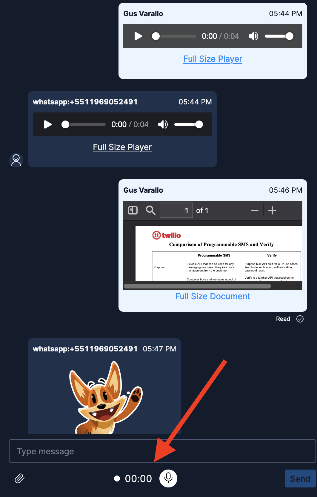

# Twilio Flex Conversations Send WhatsApp Audio Plugin

## Disclaimer

**This software is to be considered "sample code", a Type B Deliverable, and is delivered "as-is" to the user. Twilio bears no responsibility to support the use or implementation of this software.**

## CURRENT LIMITATION AS OF OCT/2022

As of Oct/2022, due to limitations in the way web browsers capture audio media, it is ONLY possible to record the audio if you open Flex in Firefox. The good thing is that I added the capability of rendering media in the chat window, regardless of the browser you use. You can still install it in your account and use Flex with other browsers normally, it will simply disregard the recording controls and allow you to take advantage of the media rendering feature.

## Important note

To use this plugin you need to have Flex Conversations enabled on your account as well as Flex UI 2.0. Please read our doc for more details about it: https://www.twilio.com/docs/flex/developer/conversations.

## Information about the plugin

This plugin adds a recording control below the text input area, in order to record audio trough the web browser and send it. On top of this, it renders all media files in the chat window. For images, it adds a capability to open them at a modal.




## Setup

- First install the dependencies:

```bash
# If you use npm
npm install
```

- Inside the `/public` folder, create a `appConfig.js` file according to the `appConfig.example.js` file.

- Finally, to deploy the plugin, run:

```bash
twilio flex:plugins:deploy --changelog "WRITE YOUR CHANGELOG HERE"
```

- You can also run the plugin locally for testing purposes:

```bash
twilio flex:plugins:start
```
